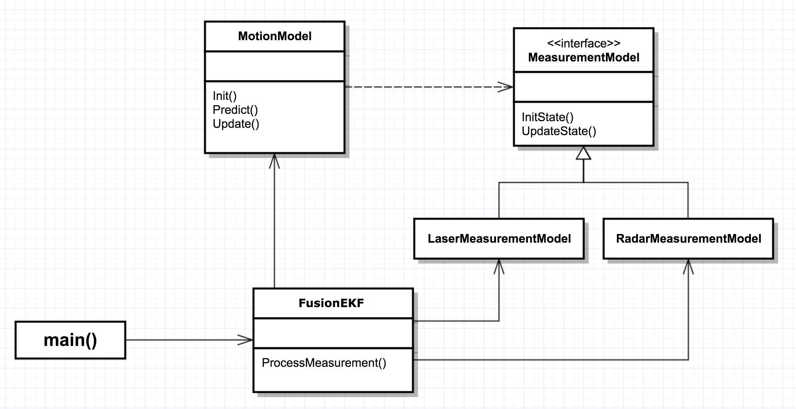

# Extended Kalman Filter 

This project is a part of Udacity's *Self-Driving Car Nanodegree* program. The
goal of the project is to implement Extended Kalman Filter algorithm that tracks
a vehicle, using noisy radar and laser (lidar) measurements as input.

# Introduction

The boilerplate code for the project was provided in the
[GitHub repository](https://github.com/udacity/CarND-Extended-Kalman-Filter-Project). However,
as I started working with it, I became dissatisfied with the suggested
application design. Eventually, I decided to come up with my own vision of the
class structure, trying to separate different aspects of the algorithm into
different entities. I describe the design I ended up in the next session.

I decided to leave the code in `main()` function mostly untouched, as the code
inside it was infrastructural and did not require major modifications. The
code in `FusionEKF` and `KalmanFilter` classes, however, was significantly
refactored.

# High-level application design

The high-level class application structure can be summarized in the following
UML diagram: 



As before, `FusionEKF` class represents a facade that hosts other pieces. Its
single public method, `FusionEKF::ProcessMeasurement()`, implements an
iteration of Kalman filter (in pseudocode):

```
if (!initialized) {
  InitializeFilter(measurement);
} else {
  PredictVehicleState();
  UpdateVehicleState(measurement);
}
```

Then, 2 other classes, `MotionModel` and `MeasurementModel` play together to
perform actual predict/update cycle. `MotionModel` is responsible for predicting
vehicle's state, while `MeasurementModel` performs calculations required to
update the state with the incoming measurement. `MeasurmenentModel` is an
interface that has 2 concrete implementations: `LaserMeasurementModel` and
`RadarMeasurementModel`.

`LaserMeasuremenentModel` implements the update step of a regular Kalman
filter, using lidar measurements *(p<sub>x</sub>, p<sub>y</sub>)* as input. 

`RadarMeasurementModel` is responsible for processing radar input in polar
coordinates *(ρ, φ, ρ')*. The specifics of radar measurements are that the
function that relates measured values and the vehicle state is non-linear, so
the regular Kalman filter is not applicable. To process the input,
`RadarMeasurementModel` implements the Extended Kalman filter update. It uses
Taylor expansion to linearize the measurement mapping function *z<sub>k</sub> =
h(x<sub>k</sub>)*.

From a design standpoint, `MeasurementModel` and its subclasses implement
*Strategy* design pattern for the `MotionModel`.

# Application performance

The result of the application tracking a vehicle is shown in the screenshot:


Here, red and blue dots mark the observations from lidar and radar,
respectively. Green dots are the estimate positions of the vehicle, calculated
by my application. As the screenshot shows, the application does a pretty
accurate job to track the vehicle's movements.

The final values for the RMSE with respect to the ground truth values, evaluated
on the test dataset, are: 

|               |       |
|---------------|-------|
| P<sub>x</sub> | 0.097 |
| P<sub>y</sub> | 0.086 |
| V<sub>x</sub> | 0.466 |
| V<sub>y</sub> | 0.472 |

All values are below the threshold required by the project. 

# Future improvements

The design I ended up with is more modular than the one that was initially
suggested. There are, however, a few directions in which this design can evolve
in the future:

* **Use of additional sensors**. It's quite easy to plug in sensors other than
radar and laser. From the `MotionModel` standpoint, one would simply need to
provide an implementation of `MeasurementModel`, specific for a new sensor
type. However, in order to make use of this implementation in the application,
one would need to make changes to `FusionEKF::SelectModel()` private method.
Therefore, one potential improvement would be to decouple the logic that selects
a specific sensor model, from the algorithm itself.

* **Algorithm generalization**. Current implementation is very specific to the
task at hand: the motion model is hard-coded, as well as noise parameters for
motion model and sensors, etc. However, Kalman filter can be applied to a wide
variety of models, and the core of the algorithm is independent of these
specifics. Thus, another possible improvement can be to extract the core generic
implementation of Kalman filter into a separate module, and implement model
specifics as plug-ins to that module. This could lead to a generic solution that
can be used for a wide range of prediction and measurement models, not even for
motion tracking, but for other applications as well.
