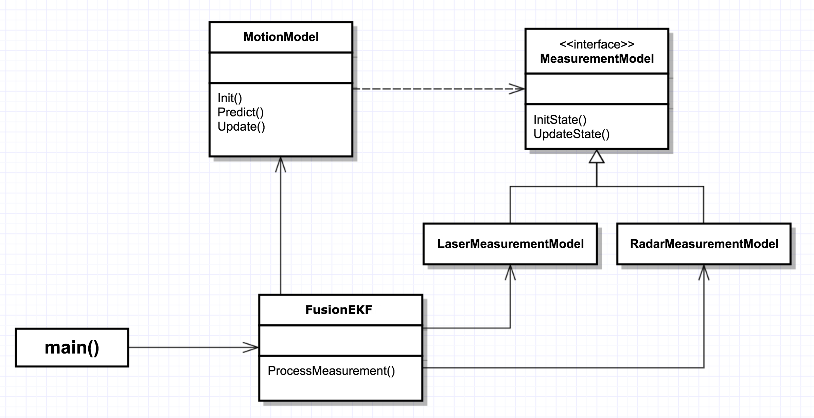
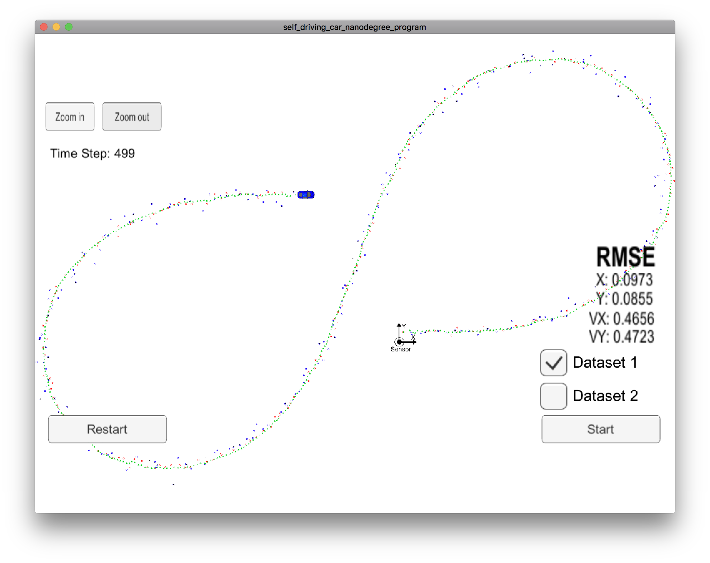

# Extended Kalman Filter 

This project is a part of Udacity's *Self-Driving Car Nanodegree* program. The
goal of the project is to implement Extended Kalman Filter algoritm that tracks
the vehicle movement, using noisy radar and laser (LIDAR) measurements as input.

# Introduction

The boilerplate code for the project was provided in a GitHub
repository(*link*). However, having started implementing the messing pieces, I
became dissatisfied with the suggested application design. Eventually, I decided
to come up with my own vision of the application's structure, trying to separate
different aspects of the algorithm into different entities. I describe the
design I ended up in the next session.

I decided to leave the code in `main()` function mostly untouched, as the code
inside it is mostly infrastructural and did not require significant
modifications. The code in `ExtendedEKF` and `KalmanFilter` classes, however,
was siginificantly refactored. 

# High-level application design

# Application performance

The result of the application tracking a vehicle is shown in the screenshot:

Here, red and blue dots mark the observations from lidar and radar,
respectively. Green dots are the estimate position of the vehicle, calculated by
my application. As the screenshot shows, the application tracks the vehicle
quite smoothly. 

The final values for the RMSE with respect to the ground truth values, evaluated
on the test dataset are: 

|               |       |
|---------------|-------|
| Px | 0.097 |
| Py | 0.086 |
| Vx | 0.466 |
| Vy | 0.472 |

All values are below the required threshold. 

# Future improvements

The design I ended up with is much more modular than the one initially
suggested. There are, however, a few directions in which this design can evolve
in the future: 

1. *Use of additional sensors*. It's quite easy to plug in the sensors other
than radar and laser. From the `MotionModel` standpoint, one would simply need
to provide an implementation of `MeasurementModel`, specific for a new sensor
type. However, in order to make use of this implementation in the application,
one would need to make changes to `ExtendedEKF::SelectModel()` private method.
Therefore, one of potential improvements would be decoupling the logic that
selects a specific sensor model, from the algorithm itself.

2. *Algorithm generalization*. Current implementation is very specific to the
task at hand: the motion model is hard-coded, as well as noise parameters for
motion model and sensors, etc. However, Kalman filter can be applied to a wide
variety of models, and the core of the algorithm is independent of these
specifics. Thus, another possible improvement can be to extract the core generic
implementation of Kalman filter into a separate module, and implement model
specifics as plug-ins to that class. This could lead to a generic solution that
can be used for a wide range of prediction and measurement models, not even for
motion tracking, but for other applications as well.
